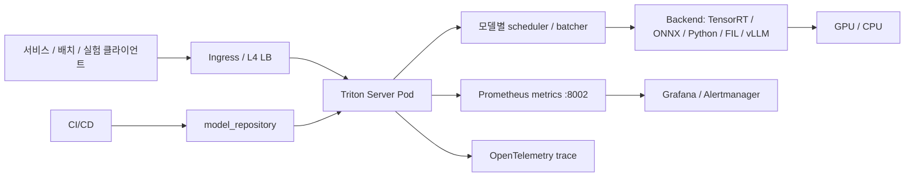

# Triton Serving Architecture

이 문서는 이 저장소가 가정하는 Triton Inference Server 운영 구조를 설명합니다. 목표는
"로컬에서 모델을 띄워본다"가 아니라, 팀이 여러 모델을 안정적으로 배포하고 관측하며
장애 시 되돌릴 수 있는 serving platform을 만드는 것입니다.

## 전체 그림



핵심 단위는 세 가지입니다.

| 단위 | 위치 | 역할 |
|------|------|------|
| Model source | `models/serving/**` | Git으로 관리하는 모델 설정, Python backend 코드, manifest |
| Model repository | `model_repository/` | Triton이 실제로 읽는 런타임 디렉토리. CI/CD 또는 `scripts/build.sh`가 생성 |
| Server runtime | `deploy/**`, `configs/**` | Docker, Helm, Kustomize, 서버 인자, 운영별 차이 |

## 요청 처리 경로

1. 클라이언트는 HTTP `:8000` 또는 gRPC `:8001`로 요청합니다.
2. Triton은 model name과 version policy를 기준으로 모델을 찾습니다.
3. 모델별 scheduler가 dynamic batching, sequence batching, rate limiter 정책을 적용합니다.
4. backend가 실제 추론을 수행합니다.
5. 결과는 클라이언트로 반환되고, metrics/statistics/trace가 남습니다.

HTTP는 디버깅과 단순 서비스 연동에 좋고, gRPC는 고빈도/대용량/streaming에 유리합니다.
Decoupled streaming 모델은 HTTP나 일반 gRPC infer가 아니라 bi-directional gRPC streaming
클라이언트를 사용해야 합니다.

## 모델 레포지토리 전략

운영에서는 `models/serving/manifest.yaml`을 source of truth로 둡니다.

```yaml
- source: vision/object_detection/yolox
  target: yolox
  tags: [gpu, tensorrt, vision]
  enabled: true
```

`source`는 Git 안의 모델 소스 경로이고, `target`은 Triton이 인식하는 모델명입니다.
이 분리를 두면 도메인별 디렉토리 구조와 런타임 모델명을 서로 독립적으로 관리할 수
있습니다.

운영 권장 흐름은 다음과 같습니다.

1. PR에서 `config.pbtxt`, Python backend, manifest를 검증합니다.
2. CI가 모델 바이너리 또는 외부 artifact를 확보합니다.
3. `scripts/build.sh --env <env> --clean`으로 `model_repository/`를 생성합니다.
4. staging에서 explicit load와 smoke/integration/perf test를 수행합니다.
5. production은 승인 후 배포하고, 실패 시 Helm rollback 또는 이전 repository revision으로 되돌립니다.

## 환경별 모델 제어 모드

| 환경 | 모드 | 이유 |
|------|------|------|
| dev | `poll` | 파일 변경을 빠르게 감지해서 반복 실험이 편함 |
| staging | `explicit` | 운영과 같은 load/unload 절차 검증 |
| prod | `explicit` | 부분 복사, 미완성 artifact, 의도치 않은 reload 방지 |

NVIDIA 문서도 `POLL` 모드는 repository 변경 타이밍과 poll 타이밍 사이에 동기화가 없기
때문에 production에는 권장하지 않는다고 설명합니다.

## Serving 패턴 선택

| 패턴 | 언제 쓰나 | 이 저장소의 위치 |
|------|-----------|------------------|
| 단일 모델 | ONNX/TensorRT/PyTorch/FIL 하나로 충분할 때 | `models/_templates/single_model/` |
| Ensemble | 전처리, 추론, 후처리가 DAG로 고정될 때 | `models/_templates/ensemble_pipeline/` |
| BLS | 조건 분기, 다중 모델 호출, fallback이 필요할 때 | `models/_templates/bls_model/` |
| Decoupled streaming | LLM token streaming, ASR처럼 응답이 여러 번 나올 때 | `models/_templates/decoupled_streaming/` |

Ensemble은 중간 tensor를 클라이언트로 왕복하지 않아 네트워크 비용이 작습니다. BLS는
Python 코드로 분기와 오류 처리를 구현할 수 있지만, 로직 복잡도와 테스트 부담이 커집니다.
고정 DAG면 Ensemble, 조건 분기가 중요하면 BLS를 먼저 검토합니다.

## 관측성

운영에서 최소로 봐야 할 신호는 다음입니다.

| 신호 | 예시 metric/API | 판단 |
|------|-----------------|------|
| 요청량 | `nv_inference_request_success` | traffic 변화, 장애 영향 범위 |
| 실패율 | `nv_inference_request_failure` | 모델/입력/서버 오류 |
| 평균 latency | `nv_inference_request_duration_us` / success rate | 사용자 체감 지연 |
| queue time | `nv_inference_queue_duration_us` | batcher/rate limiter/GPU 병목 |
| GPU 사용률 | `nv_gpu_utilization` | scale-out 또는 instance 조정 |
| cache hit/miss | `nv_cache_num_hits_per_model` | response cache 효과 |
| 모델별 통계 | `/v2/models/{name}/stats` | dynamic batching 효과, execution count |

p99가 필요하면 Triton의 summary/histogram latency metric을 명시적으로 켜고 Prometheus
rule을 별도로 구성합니다. 기본 counter만 있을 때는 이 저장소처럼 5분 평균 latency를
먼저 경보로 둡니다.

## 참고 문서

- NVIDIA Triton Architecture: https://docs.nvidia.com/deeplearning/triton-inference-server/user-guide/docs/user_guide/architecture.html
- Model Management: https://docs.nvidia.com/deeplearning/triton-inference-server/user-guide/docs/user_guide/model_management.html
- Ensemble Models: https://docs.nvidia.com/deeplearning/triton-inference-server/user-guide/docs/user_guide/ensemble_models.html
- Metrics: https://docs.nvidia.com/deeplearning/triton-inference-server/user-guide/docs/user_guide/metrics.html
