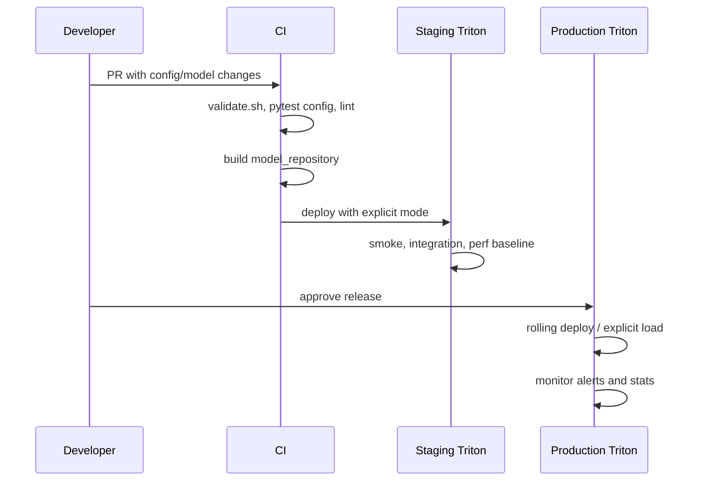

# Production Adoption Guide

이 문서는 이 저장소를 실제 production serving에 도입할 때의 결정 순서와 운영 기준을
정리합니다. 모든 팀이 처음부터 전체 구성을 쓸 필요는 없습니다. 아래 maturity 단계를
하나씩 통과하면서 적용 범위를 넓히는 방식을 권장합니다.

## Maturity 단계

| 단계 | 목표 | 완료 기준 |
|------|------|-----------|
| 0. Sandbox | Triton과 모델 config 이해 | 로컬 Docker에서 단일 모델 load, health check 성공 |
| 1. Staging | 배포 절차 검증 | `explicit` 모드, smoke/integration test, metrics 수집 |
| 2. Production single service | 한 서비스의 안정 운영 | rollback, alert, SLO, model artifact 이력 확보 |
| 3. Shared platform | 여러 팀/모델 공용화 | manifest 표준, quota/rate limit, ownership, runbook |

## 도입 전 질문

1. 모델 traffic은 online 요청인가, batch/비동기 요청인가?
2. latency SLO와 throughput 목표는 무엇인가?
3. 모델 입력 shape은 고정인가, 가변인가?
4. 같은 입력이 반복되어 response cache가 의미 있는가?
5. 모델 업데이트는 하루 몇 번 일어나는가?
6. GPU 한 장에 여러 모델을 같이 올릴 것인가?
7. 장애 시 모델을 내릴지, 이전 버전으로 되돌릴지, traffic을 우회할지 정했는가?

이 질문에 답하지 못하면 먼저 staging에서 traffic replay와 perf analyzer를 돌리는 편이
좋습니다.

## 권장 production 설정

| 영역 | 권장값 | 이유 |
|------|--------|------|
| model control | `--model-control-mode=explicit` | 운영 중 부분 변경 감지 위험 제거 |
| repository | immutable artifact + revision | rollback 가능성 확보 |
| cache | `--cache-config=local,size=...`부터 검증 | 기본 구현으로 효과 확인 후 확장 |
| rate limiter | GPU memory가 빡빡한 모델부터 적용 | OOM과 cross-model 간섭 완화 |
| logging | `--log-verbose=0` | 정상 traffic에서 로그 비용 최소화 |
| metrics | `--allow-metrics=true`, `--allow-gpu-metrics=true` | Prometheus 기반 운영 관측 |
| probes | live/ready 분리 | 시작 지연과 실제 장애를 분리 |
| replicas | 최소 2개 이상 | rolling update와 node 장애 대응 |
| PDB | prod에서 활성화 | voluntary disruption 중 가용성 보호 |

## 배포 흐름

## Release checklist

배포 전:

- `config.pbtxt`의 `name`, `backend/platform`, input/output, `max_batch_size` 확인
- 모델 바이너리 파일명과 backend 기대 파일명 확인 (`model.onnx`, `model.plan`, `model.py` 등)
- `model_warmup` 입력 shape와 실제 입력 shape 일치 확인
- `response_cache`를 켠 모델은 deterministic output인지 확인
- `instance_group` count와 GPU memory 사용량 확인
- `scripts/build.sh --env staging --clean` 결과물 확인
- staging에서 `/v2/models`, `/ready`, `/stats`, `/metrics` 확인
- perf baseline 대비 latency/throughput 악화 여부 확인

배포 후:

- 5분 동안 error rate, average latency, queue time, GPU memory 확인
- 새 모델 version이 의도대로 선택되는지 확인
- cache hit/miss가 예상 범위인지 확인
- client timeout/retry 로그 증가 여부 확인

Rollback 기준:

- error rate가 SLO를 2회 연속 초과
- queue time이 지속 증가하고 scale-out으로 회복되지 않음
- GPU OOM 또는 model unavailable 발생
- 응답 schema가 이전 contract와 달라 downstream 장애 발생

## 운영 시 자주 하는 실수

| 실수 | 증상 | 예방 |
|------|------|------|
| prod에서 `poll` 사용 | 미완성 파일을 읽고 model unavailable | prod는 `explicit`만 사용 |
| 모델 바이너리 없이 config만 배포 | server ready 실패, model unavailable | artifact 존재 검사 추가 |
| dynamic batching만 켜고 traffic이 낮음 | latency만 늘고 throughput 효과 없음 | queue delay와 request concurrency 함께 튜닝 |
| cache를 비결정 모델에 적용 | 오래된/부정확한 응답 | deterministic 모델만 cache |
| Python backend에 무거운 전처리 집중 | CPU 병목, queue 증가 | 전처리 최적화 또는 별도 scale |
| alert가 없는 metric을 참조 | 경보 미발생 | 실제 `/metrics` 출력 기준으로 rule 작성 |

## 운영 인수 파일의 역할

`configs/*.txt`는 "왜 이 값을 쓰는지"를 남기는 운영 메모입니다. Helm/Kustomize/Docker
설정과 1:1로 완전히 자동 합성되지는 않지만, 값 변경 시 함께 갱신해야 하는 기준 문서로
사용합니다.

환경별 실제 실행 인자는 다음 위치에 있습니다.

- Docker dev: `deploy/docker/docker-compose.yml`
- Docker prod: `deploy/docker/docker-compose.prod.yml`
- Helm: `deploy/helm/triton/values*.yaml`
- Kustomize: `deploy/k8s/base`, `deploy/k8s/overlays/*`

## 참고 문서

- Model Management: https://docs.nvidia.com/deeplearning/triton-inference-server/user-guide/docs/user_guide/model_management.html
- Rate Limiter: https://docs.nvidia.com/deeplearning/triton-inference-server/user-guide/docs/user_guide/rate_limiter.html
- Response Cache: https://docs.nvidia.com/deeplearning/triton-inference-server/user-guide/docs/user_guide/response_cache.html
- Performance Tuning: https://docs.nvidia.com/deeplearning/triton-inference-server/user-guide/docs/user_guide/performance_tuning.html
